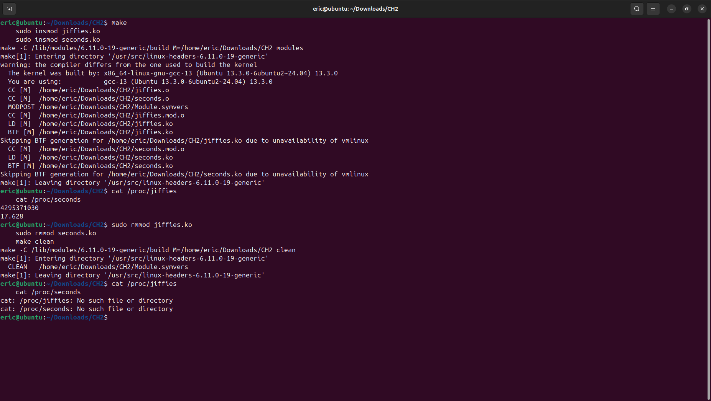
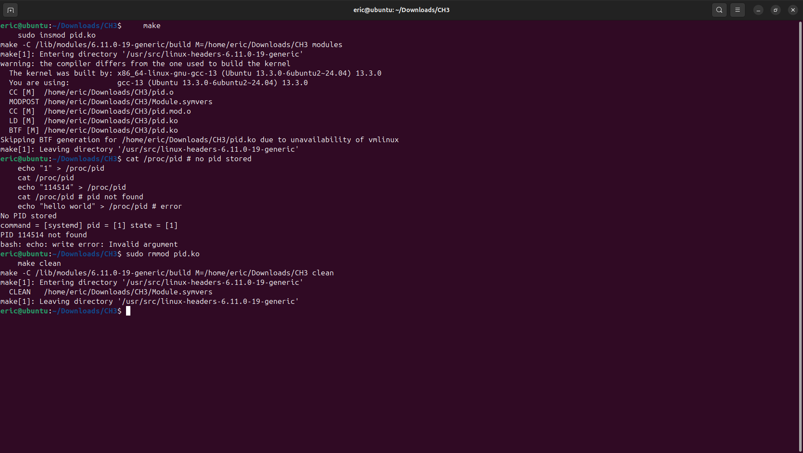

# **程式小組作業**

## **小組分工**
- **組員及負責內容：**
  - **[111590002 鄭重雨]：** [Ch.2_proj]
  - **[111590010 林益賢]：** [Ch.3_proj2]
  - **[111590027 陳睿泰]：** [documentation]
  - **[111590028 林柏儒]：** [測試]

---

## **Ch2說明**
- **特殊環境需求：**
  - Please ensure your kernel version is later than 5.6.0 in your environment, then run these commands:
    ``` bash
    sudo apt update
    sudo apt install build-essential linux-headers-$(uname -r) # gcc + make + linux headers
    ```

- **編譯及使用**
  - 進入專案目錄後執行以下指令：
    ```bash
    make
    sudo insmod jiffies.ko
    sudo insmod seconds.ko
    ```
  
  - 執行以下指令以測試：
    ```bash
    cat /proc/jiffies
    cat /proc/seconds
    ```

  - 移除模組時執行：
    ```bash
    sudo rmmod jiffies.ko
    sudo rmmod seconds.ko
    make clean
    ```

- **螢幕截圖**
  

---

## **Ch3_proj2說明**
- **特殊環境需求：**
  - Please ensure your kernel version is later than 5.6.0 in your environment, then run these commands:
    ``` bash
    sudo apt update
    sudo apt install build-essential linux-headers-$(uname -r) # gcc + make + linux headers
    ```

- **編譯及使用**
  - 進入專案目錄後執行以下指令：
    ```bash
    make
    sudo insmod pid.ko
    ```

  - 執行以下指令以測試：
    ```bash
    cat /proc/pid # no pid stored
    echo "1" > /proc/pid
    cat /proc/pid
    echo "114514" > /proc/pid
    cat /proc/pid # pid not found
    echo "hello world" > /proc/pid # error
    ```

  - 移除模組時執行：
    ```bash
    sudo rmmod pid.ko
    make clean
    ```

- **螢幕截圖**
  

